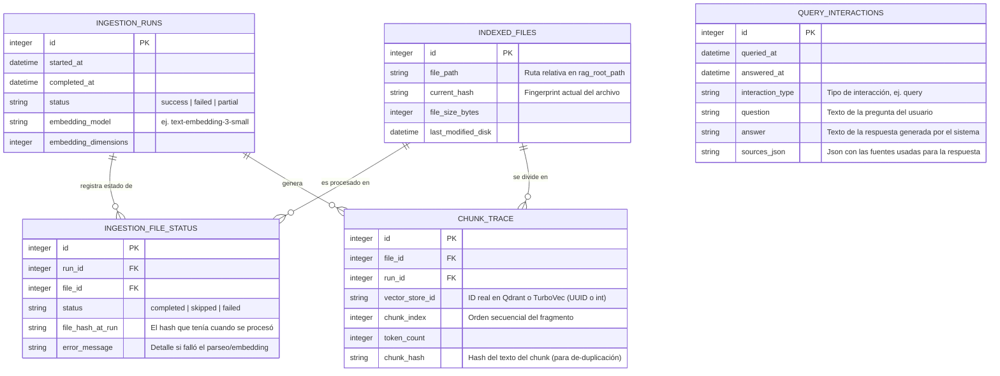

# rag

Sistema RAG en Python con LangChain, TurboVec, Qdrant y FastAPI.

## Estructura

- env/: archivos de configuración
- rag/: se encontrarán los archivos .md para embeddings
- scripts/: utilidades y conversiones para GitLab, Kiwi y tokens.
- src/rag/ingestion: carga y split de Markdown.
- src/rag/vectorstore: gestion de TurboVec y metadatos.
- src/rag/rag: LLM, prompt y formato de contexto.
- src/rag/api: FastAPI y contratos.

## Enlaces de interés

   - Swagger UI: http://localhost:8000/docs
   - ReDoc: http://localhost:8000/redoc
   - Qdrant Dashboard: http://localhost:6333/dashboard

> En Swagger UI usa el botón `Authorize` y agrega el token

## Variables de entorno

Usa env/.env.example como referencia.

## Ejecución manual

0. Instalar UV, Docker, Ollama

* [UV](https://docs.astral.sh/uv/getting-started/installation/)
* [Docker](https://docs.docker.com/engine/install/)
* [Ollama](https://docs.ollama.com/linux)


1. Instalar dependencias:

   ```bash
   uv sync
   ```

1. Configurar variables:

   ```bash
   cp env/.env.example env/.env
   ```

1. Añadir `API_KEY` a `env/.env`:

   ```bash
   echo "API_KEY=$(openssl rand -hex 32)" >> env/.env
   ```

1. Desplegar qdrant

    ```bash
    docker run -d \
      --name rag-qdrant \
      -p 6333:6333 \
      -p 6334:6334 \
      -v "$(pwd)/data/qdrant:/qdrant/storage" \
      qdrant/qdrant:latest
    ```

1. Descargar los modelos en ollama
    
    ```bash
    source env/.env
    
    ollama pull "$LLM_MODEL_OLLAMA"
    ollama pull "$EMBEDDINGS_MODEL_OLLAMA"
    ollama serve
    ```

1. Levantar API:

    ```bash
    uv run uvicorn rag.api.main:app --host 0.0.0.0 --port 8000 --reload
    ```

1. Ver estado operativo:

    ```bash
    curl -H "Authorization: Bearer $API_KEY" http://localhost:8000/status
    curl -H "Authorization: Bearer $API_KEY" http://localhost:8000/config
    ```

1. Generar embeddings manualmente:

    ```bash
    curl -X POST http://localhost:8000/ingest \
           -H "Authorization: Bearer $API_KEY" \
           -H "Content-Type: application/json" \
           -d '{"force_reindex": true}'
    ```

1. Listado de ejecuciones

    ```bash
    curl -X 'GET' \
    'http://localhost:8000/ingest/traceability?page=1&page_size=10' \
    -H 'Authorization: Bearer $API_KEY' \
    -H 'accept: application/json'
    ```

1. Detalle de ejecución

    ```bash
    curl -X 'GET' \
    'http://localhost:8000/ingest/traceability/1/files?page=1&page_size=10' \
    -H 'Authorization: Bearer $API_KEY' \
    -H 'accept: application/json'
    ```

1. Consultar:

    ```bash
    curl -X POST http://localhost:8000/query \
         -H "Authorization: Bearer $API_KEY" \
         -H "Content-Type: application/json" \
         -d '{"question":"De que trata la documentacion?"}'
    ```

## Integracion con Telegram

Configura estas variables en env/.env:

- TELEGRAM_BOT_TOKEN
- TELEGRAM_WEBHOOK_URL

Registrar webhook desde la API:

```bash
curl -X POST http://localhost:8000/telegram/set-webhook
```

## Modelo de trazabilidad


